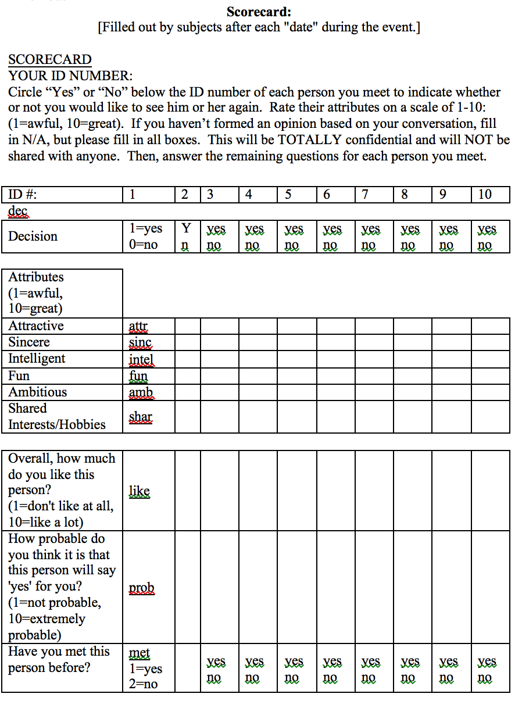

# Romance

## Os dados
Temos dados descrevendo 5000 encontros relâmpagos (speed dating, procura no google) de 4 minutos envolvendo 310 jovens americanos. Os dados originais foram coletados por professores da Columbia Business School. Aqui estamos usando uma versão com menos colunas para agilizar para vocês.

Os participantes tinham vários encontros de 4 minutos por noite. Após cada um, preenchiam fichas avaliando aqueles com quem se encontraram. Cada linha nos dados representa um desses encontros.

## As perguntas
O que causa atração à primeira vista? E como isso varia para diferentes sexos? Pessoas de diferentes backgrounds? O que são as características mais e menos importantes para um homem/mulher ser percebido bem em um speed date? Que grupos são mais otimistas e pessimistas após o encontro?

## As variáveis

**Cuidados importantes** : se certifique de usar as variáveis com o tipo correto (character x número) e lide com NAs.

- iid : id do participante p1 no encontro
- gender : sexo do p1, 0 = mulher
- order : dos vários encontros realizados em uma noite, esse foi o n-ésimo, segundo essa variável
- pid : id do participante p2
- int_corr : correlação entre os interesses de p1 e p2
- samerace : p1 e p2 são da mesma raça?
- age_o : idade de p2
- age : idade de p1
- field : campo de estudo de p1
- race : raça de p1. O código é Black/African American=1; European/Caucasian-American=2; Latino/Hispanic American=3; Asian/Pacific Islander/Asian-American=4;	Native American=5; 	Other=6
- from : de onde p1 é
- career : que carreira p1 quer seguir
- sports, tvsports, exercise, dining, museums, art, hiking, gaming, clubbing, reading, tv, theater, movies, concerts, music, shopping, yoga : De 1 a 10, quão interessado p1 é em cada uma dessas atividades.  
- attr : quão atraente p1 achou p2
- sinc : quão sincero p1 achou p2
- intel : quão inteligente p1 achou p2    
- fun : quão divertido p1 achou p2
- amb : quão ambicioso p1 achou p2
- shar : quanto p1 achou que compartilha interesses e hobbies com p2
- like : no geral, quanto p1 gostou de p2?
- prob : que probabiliade p1 acha que p2 tem de querer se encontrar novamente com p- (escala 1-10)
- attr3_s : quanto p1 acha que é atraente
- sinc3_s : quanto p1 acha que é sincero
- intel3_s : quanto p1 acha que é inteligente
- fun3_s : quanto p1 acha que é divertido
- amb3_s : quanto p1 acha que é ambicioso

### O formulário

Boa parte dos dados vem daqui: Inline-style:

